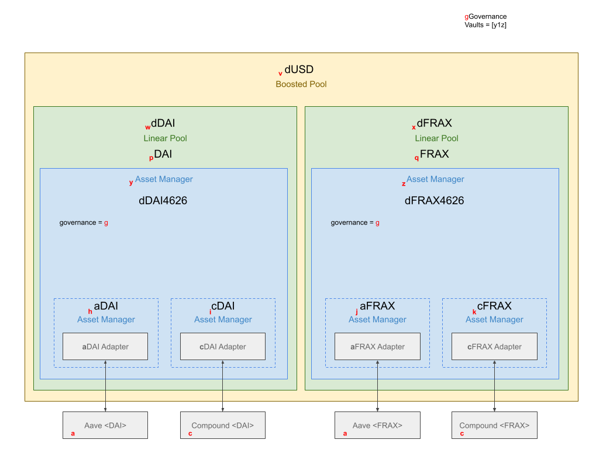

Happy new year Dynamos! :tada:

We are progressing in the development of our ERC-4626 vault.
We plan to apply this vault structure within our decentralised base pool that we deploy as a boosted pool on Balancer V2.

A general diagram for the infrastructure can be seen below, however, an overall overview will be posted as a separat part of the documentation.
Furthermore, we will update this blog post with new insights about development steps.

Above the blue parts (Assetmanager) are Vyper contracts that have been developed internally within the past months.
Those asset manager interact with linear pools as developed by Balancer.
All linear pools are incorporated in a boosted stable pool.
Hence we are able to shift most of the liquidity to the ERC-4626 vaults, which will then be deployed to different lending markets (e.g., AAVE or Compound).

The proportions of the underlying lending markets are defined by asset-specific Strategies.
In order to participate as a Strategist, a new set of weights has to be proposed.
This new set of weights has to increase the APY of the asset-specific vault.
If it does, the Strategy goes live and the Strategist earns part of the revenue that is collected while the Strategy is active.

The governance part of the ERC-4626 vault will be released soon as well.

### Update 2023-01-13

Since the Balancer infrastructure does not allow an easy solution for custom asset manager yet (maybe in Balancer V3?), we decided to interface with the ERC-4626 vaults directly.

