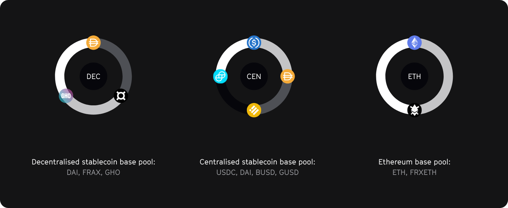

We aim to build different Dynamo base pools to cover a wide range of liquidity products in the near future.
Our aim is to develop and deploy a decentralised stable coin, a centralised stable coin and an eth-based base pool.
The decentral stable coin base pool (DEC) consists of Frax, GHO, and DAI, the central stable coin base pool (CEN) of USDC, DAI, BUSD and GUSD, and the ETH base pool (ETH) consists of native ETH and frxETH.

The graph below serves as an in-depth visualization for our DEC base pool:

Our DEC is built on top of the Balancer boosted pool infrastructure and enables liquidity providers to optimise their yield through the use of our vault architecture.
A Balancer liquidity provider (BLP) is able to provide liquidity in exchange for the liquidity pool token (termed as USD in the depiction).
If a user provides DAI to the liquidity pool, the DAI will be deposited in the DAI linear pool while the liquidity provider will receive USD in return.
Due to the way boosted pools work 90% of the DAI that is deposited in the DEC will be routed into our DAI vault.
The DAI vault will then mobilise that capital in supported lending venues.

The capital that flows into a Dynamo vault becomes active through the vault rebalancing process, which puts that capital into productive use by splitting it into the underlying lending platforms based on the current vault allocation as outlined in the weight distribution of the respective vault.
Weight distributions are determined through the vault reweight process which keeps the allocations of Dynamo vaults in sync with interest rates by allowing independent strategists to submit weight proposals that increase Dynamo vault yields in exchange for 1.0% of the yield that is generated by the respective vault for as long as the proposal remains active.

On top of enabling liquidity providers to integrate lending into their strategies, our protocol will also allow them to optimise their liquidity mining activities by offering a range of autocompounding vaults that liquidity providers can utilise in order to interact with our base pool infrastructures in a plug and play manner.
Our autocompounding vaults will maximise the efficiency of the yield farming process by socialing the costs that come with it.
This autocompounding vault infrastructures will also enable the development of metapool liquidity by allowing the liquidity providers of metapools to tap into the liquidity mining rewards of our base pools.
