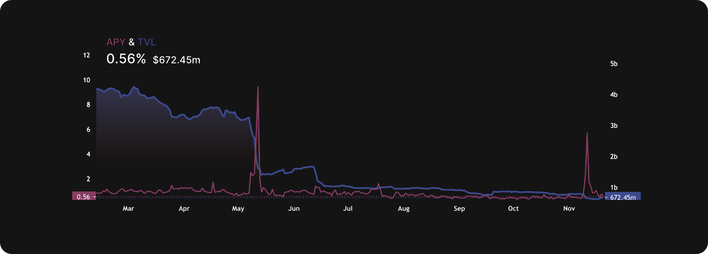

A stablecoin is a type of cryptocurrency that is designed to maintain a stable value, usually pegged to a fiat currency such as the US dollar.
A stablecoin is often used as a means of storing value or as a way to transfer value between different cryptocurrencies.

A stablecoin pool is a group of investors who pool their funds together in order to purchase and hold a large amount of stablecoins.
The purpose of a stablecoin pool is to provide stability to the value of the stablecoin, as the pool is able to absorb market fluctuations and maintain the value of the stablecoin at a consistent level.
To create a stablecoin pool, investors deposit their funds into the pool and receive a share of the pool's holdings in return.

The value of the stablecoin is maintained by the pool through a process called rebalancing. If the value of the stablecoin begins to fluctuate significantly, the pool may sell some of its stablecoins and use the proceeds to purchase other assets that are expected to hold their value better.
This helps to stabilize the value of the stablecoin and prevent large fluctuations in its price.

Overall, a stablecoin pool is a way for investors to gain exposure to stablecoins while mitigating some of the risks associated with holding them individually. It is important to note, however, that stablecoin pools are not without risk, as the value of the stablecoin and the assets held by the pool may still fluctuate and may not always maintain their value.

Curve[^1] is a decentralized exchange that allows users to trade a variety of cryptocurrencies. One of the features offered by Curve is a stablecoin pool called the "Curve stablecoin pool," or simply "Curve pool."
The Curve stablecoin pool is a collection of stablecoins that are managed by a smart contract on the Ethereum blockchain.

To participate in the Curve stablecoin pool, users can deposit stablecoins into the pool in exchange for a share of the pool's holdings. The pool then uses these stablecoins to provide liquidity for trades on the Curve platform.

Overall, the Curve stablecoin pool is a way for users to trade stablecoins on the Curve platform while benefiting from the stability of a diversified portfolio of stablecoins. It is important to note, however, that the value of the stablecoins in the pool may still fluctuate and may not always maintain their value.

In a stablecoin pool, fees are typically generated when users trade stablecoins on the platform. When a user buys or sells stablecoins, they may be required to pay a fee to the pool or to the liquidity provider. These fees are often a percentage of the trade value and are used to compensate the pool or the liquidity provider for the liquidity they provide to the platform.

For liquidity providers, participating in a stablecoin pool can provide a source of yield through the fees they earn for providing liquidity to the platform.
However, most of the liquidity in such stablecoin pools sits idle since the amount of swaps covers only about 10% actively.
Below we show annual percentage yields (APYs) and total value locked (TVL) within Curve's 3pool stablecoin pool. The average APY is below one percent (data from DefiLlama[^2]).

### Citations

[^1]: Curve: [Markets](https://curve.fi/#/ethereum/swap)
[^2]: DefiLlama: [Dashboards](https://defillama.com/)
