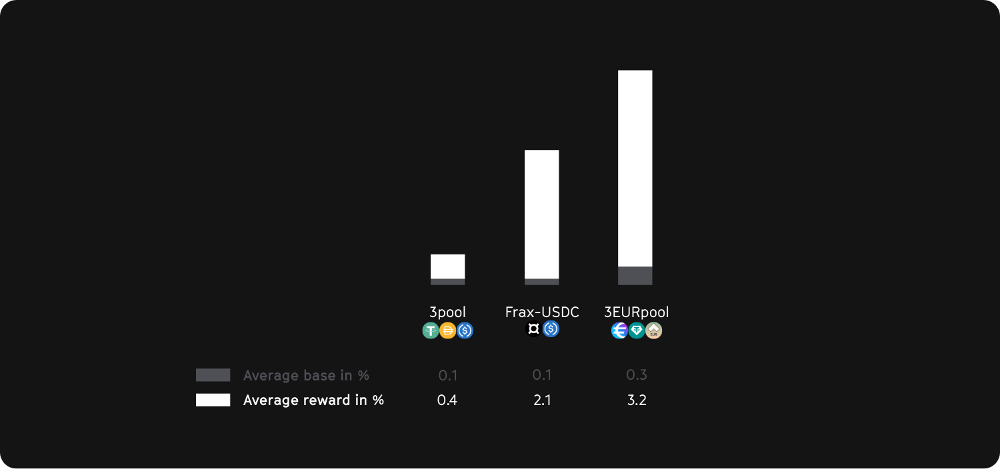
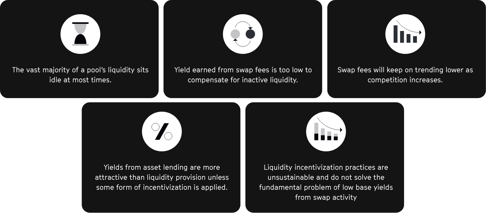

In decentralized finance (DeFi), liquidity mining is a process by which users can earn rewards for providing liquidity to certain DeFi protocols or platforms.

To participate in liquidity mining, users must first deposit their funds into a liquidity pool by buying or selling a specific cryptocurrency as described [earlier](./1_legacy_stable_pools.md).
This cryptocurrency is typically a stablecoin, which is a type of cryptocurrency that is designed to maintain a stable value, usually pegged to a fiat currency such as the US dollar.

Once their funds are deposited into the liquidity pool, users can earn rewards for their participation in the form of a percentage of the transaction fees generated by the platform or by the appreciation of the value of the cryptocurrency they have deposited. These rewards are often distributed to users on a regular basis, such as daily or weekly.

Liquidity mining can provide users with a way to earn passive income by participating in DeFi protocols or platforms. It is important to note, however, that liquidity mining is not without risk, as the value of the cryptocurrency that is deposited into the liquidity pool may fluctuate and may not always maintain its value. Users should carefully consider the risks and rewards of liquidity mining before deciding to participate.

We have analysed three different liquidity pools according to how much of the rewards are obtained through swap transactions and how much through liquidity rewards.
Our results show that only a very small fraction of the yield is actually generated by swap transactions (average base). Most of the rewards are generated by artificially created liquidity rewards (20-90%), which will significantly decrease in value over the next few years due to inflation and a decline in demand.

This shows that the classic solution of such liquidity pools (legacy pools) is not sustainable and better approaches are needed.
The problems of legacy pool structures are summarized as follows:

