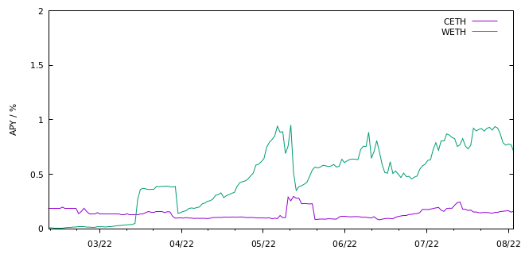

In decentralized finance (DeFi), asset lending refers to the practice of lending out assets, such as cryptocurrencies or stablecoins, to borrowers in exchange for an interest payment. This process is typically facilitated by DeFi platforms or protocols that connect lenders and borrowers and manage the lending process.

Lenders can lend out their assets by depositing them into a lending pool on the DeFi platform. Borrowers can then request to borrow a certain amount of the asset, and if the request is approved, the borrower pays an interest rate to the lender for the duration of the loan. The interest rate is typically based on market supply and demand and may fluctuate over time.

Asset lending in DeFi can provide lenders with a way to earn passive income by lending out their assets and collecting interest payments. It can also provide borrowers with access to assets that they may not have otherwise been able to obtain.

However, it is important to note that asset lending in DeFi carries risks, as the value of the assets being lent out may fluctuate and may not always maintain their value.
Below we exemplify interest rate fluctuations (annual percentage yields, APYs) of different assets for two lending markets in a time frame of eight months (Compound[^1]: CDAI, CUSDT, CUSDC, CETH AAVE[^2]: ADAI, AUSDT, AUSDC, WETH data from DefiLlama[^3]).

The interest rate on a loan is typically determined by supply and demand in the market.
When there is a high demand for a particular asset and a limited supply, lenders may be able to charge higher interest rates for loans of that asset.
Conversely, when there is a surplus of an asset and a low demand, lenders may have to lower their interest rates in order to attract borrowers.

It is therefore reasonable to balance out interest rate differences between multiple lending markets to obatain the best possible rate for the enduser.
The examples show furthermore that the APYs that can be gained by lending assets are up to an order of magnitude higher than those that can be generated by swap fees.

### Citations

[^1]: Compound: [Markets](https://compound.finance/)
[^2]: AAVE: [Markets](https://aave.com/)
[^3]: DefiLlama: [Dashboards](https://defillama.com/)
