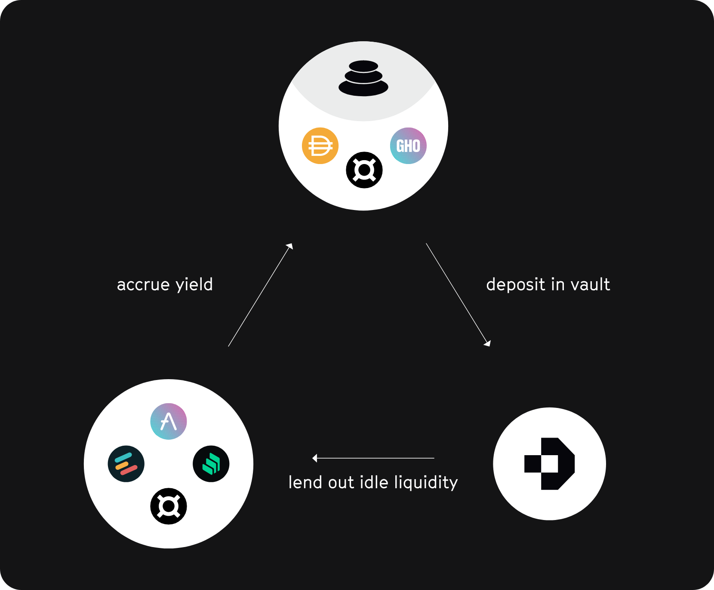
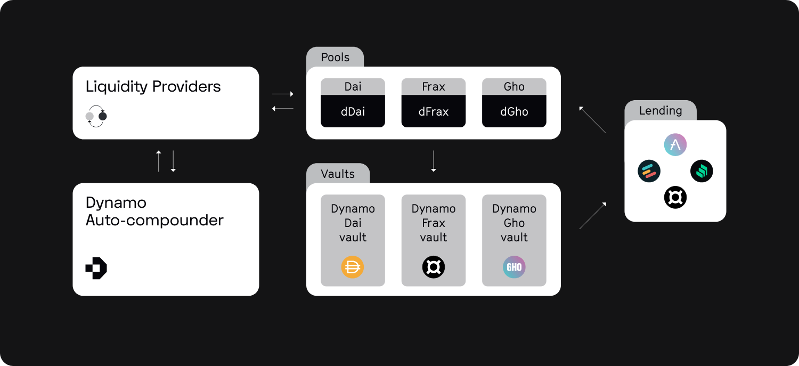

As mentioned earlier, large parts of the assets in liquidity pools are not in active use by traders.
Our research showed that only about 10% are in active use to sufficiently cover swap trades in a pool.
The remaining 90% of the liquidity is therefore idle in the pool.

Dynamo activates the idle liquidity by deploying them into protocols that provide sustainable APYs.
As discussed previously, sustainable APYs are generated by lending markets, however, interest rates can differ significantly between markets.
We thus use different lending markets for each asset and deploy these assets using suggested strategies.
A strategy is suggested by a strategist and is activated if achieving a higher APY and is not rejected by guards.

Our protocol runs on Balancer V2 and uses their boosted pool infrastructure.
Boosted pools allow parts of the liquidity in one pool to be moved to another smart contract.
The first boosted pool (bb-a-USD), for example, has already lent out assets on AAVE and thus significantly increased the base reward of the pool.
The disadvantage of this boosted pool is that the assets can only be lent on AAVE and thus the fluctuations in interest rates cannot be compensated.
We have therefore decided to abstract the integration of different lending markets within a ERC-4626 vault we have developed.

As soon as a liquidity provider deploys its assets into the pool, they are deployed into our vault and lent to different lending markets through a rebalancing process. The weights of the respective protocols are determined based on the currently active strategy. All weights add up to one.
Below is a simplified illustration of the flow of assets within the decentralised base pool:

