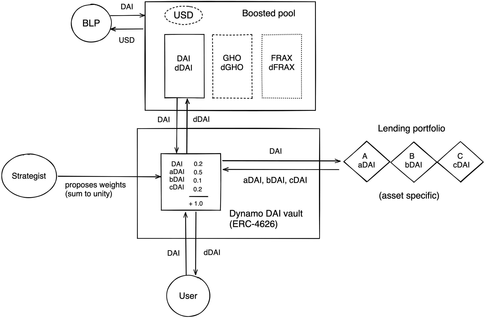

The graph below serves as a visualisation of Dynamo's base pool architecture:

The Dynamo decentralised stablecoin base pool is built on top of the Balancer boosted pool infrastructure and enables liquidity providers to optimise their yield through the use of Dynamo's vault architecture. A Balancer liquidity provider (BLP) is able to provide liquidity in exchange for the liquidity pool token (termed as USD in this depiction). If a user provides DAI to the liquidity pool, the DAI will be deposited in the DAI linear pool while the liquidity provider will receive USD in return. Due to the way boosted pools work 90% of the DAI that's deposited in the decentralised stablecoin base pool will be routed into the Dynamo DAI vault. The Dynamo DAI vault will then mobilise that capital in supported lending venues.

The capital that flows into a Dynamo vault becomes active through the vault rebalancing process which puts that capital into productive use by splitting it into the underlying lending platforms based on the current vault allocation as outlined in the weight distribution of the respective vault. Weight distributions are determined through the vault reweight process which keeps the allocations of Dynamo vaults in sync with interest rates by allowing independent strategists to submit weight proposals that increase Dynamo vault yields in exchange for 1.0% of the yield that is generated by the respective vault for as long as the proposal remains active. Please review the Governance section to get a better understanding of the Dynamo vault infrastructure.

On top of enabling liquidity providers to integrate lending into their strategies Dynamo will also allow them to optimise their liquidity mining activities by offering a range of autocompounding vaults that liquidity providers can utilise in order to interact with the Dynamo base pool infrastructure in a plug and play manner. Dynamo's autocompounding vaults will maximise the efficiency of the yield farming process by socialing the costs that come with it. The Dynamo autocompounding vault infrastructure will also enable the development of metapool liquidity by allowing the liquidity providers of Dynamo metapools to tap into the liquidity mining rewards of Dynamo's base pools.
