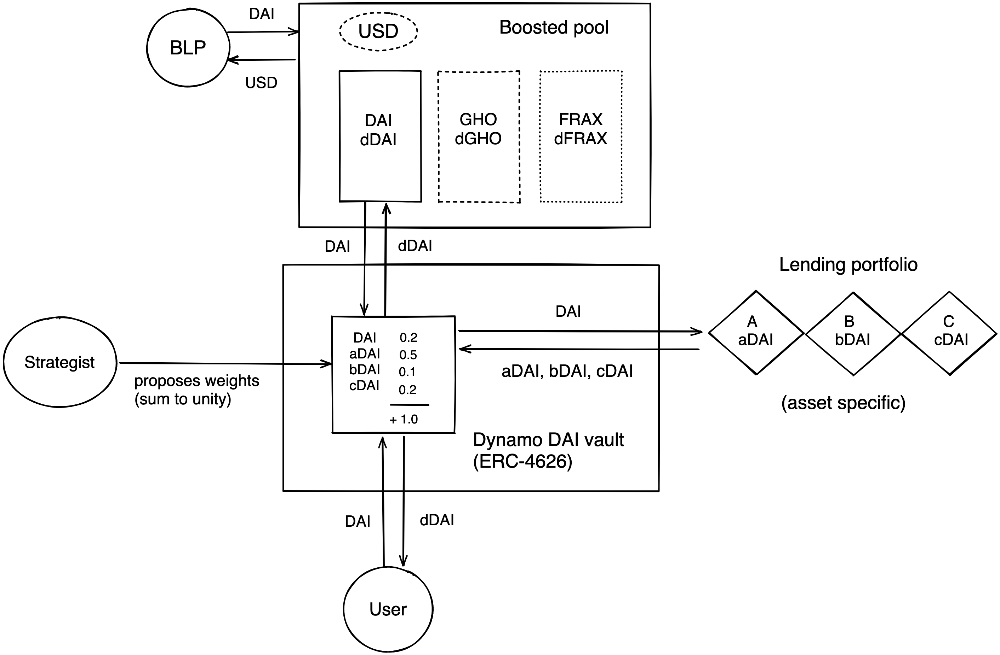

Below we exemplify one base pool composition for decentralised stable coins.

This 3pool uses the Balancer boosted pool infrastructure to combine linear pools with Dynamo vaults.
A Balancer liquidity provider (BLP) is able to provide liquidity in exchange of the liquidity pool token (termed as USD in this depiction).
If a user provides DAI to the liquidity pool, this asset will be exchanged with USD and "lands" in the DAI linear pool.
Due to the boosted pool infrastructure, 90% of the provided DAI will be shifted into the DAI Dynamo vault.
Inside the vault, the capital waits for a rebalancing event to be shifted to various lending platforms.
The composition of the lending platforms is determined by the currently active Strategy.

A Strategy is proposed by a Strategist that will earn 1% of the generated revenue (while their Strategy is active) as reward for the successfully proposed Strategy.
Please review the [Governance](./Vaults/governance) section to get familiar with the vault infrastructure.

Users can also directly enter the Dynamo vaults to obtain a receipt token (DAI $\rightarrow$ dDAI).
However, we plan to participate in additional liquidity farming through LP token staking, which would only be possible by providing liquidity to the liquidity pools.
