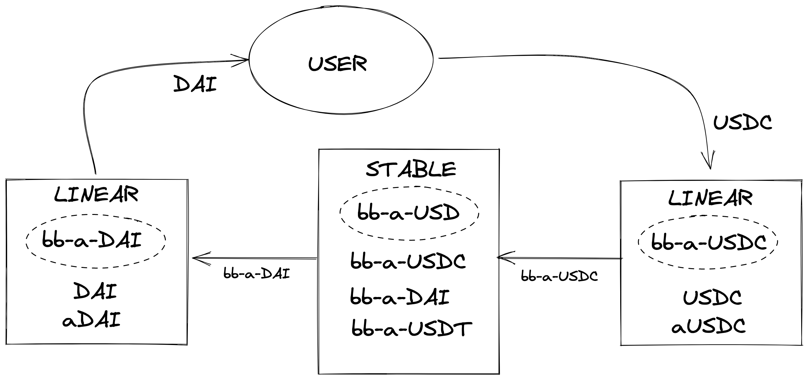

Balancer boosted (BB) pools offer the best of both worlds for liquidity providers
and swappers.
Swappers get access to deep stablecoin liquidity with near-parity exchange rates, while liquidity providers can send their liquidity positions to external lending market protocols like AAVE.
These versions of stable pools do not directly hold the stablecoins themselves, but rather hold the pool tokens of nested linear pools, which, for the AAVE example, maintain proper balances of $\textit{TOKEN}$ and $\textit{aTOKEN}$ facilitating trades between them.
Boosted pools are designed to deliver high capital efficiency by enabling users to provide trade liquidity for common tokens while forwarding idle tokens to external protocols.
This gives liquidity providers the benefits of a yield generator on top of the swap fees they collect from trades within the base pool.
Furthermore, nesting pool tokens creates a powerful avenue for swaps between any stablecoin and any wrapped token in the boosted pool.

One of the key features that makes trades through boosted pools so simple is the
use of phantom pool tokens ($PPT$).
Normally when a liquidity provider joins/exits a pool, the pool mints/burns pool tokens as needed. This is gas intensive and requires users to execute a $\textit{join}$ or $\textit{exit}$.
In pools that use $PPT$, however, all pool tokens are minted at the time of pool creation and are held by the pool itself.
Liquidity providers use a swap (or more likely Balancer’s $\textit{batchSwap}$) to trade to
or from a pool token to $\textit{join}$ or $\textit{exit}$, respectively.
The BB Aave USD Pool[^1] (bb-a-USD) demonstrates how nesting linear pools with $PPT$ inside a stable pool with $PPT$ can consolidate stablecoin liquidity while improving the liquidity provider
experience.
First, three linear pools are created for DAI, USDC, and USDT each having $PPT$ (bb-a-$\star$, $\star$ = DAI, USDC, and USDT) and maintain target balances for base tokens and their wrapped counterparts.

By integrating multiple linear pool tokens into a boosted pool, we are effectively putting the pools inside another pool (termed as base pool).
Swapping tokens within the base pool is easily possible through the use of a $\textit{batchSwap}$ call that goes from one stablecoin to another as exemplified below

### Citations

[^1]: Balancer Aave Boosted Pool: [bb-a-USD](https://app.balancer.fi/#/pool/0x7b50775383d3d6f0215a8f290f2c9e2eebbeceb20000000000000000000000fe)
