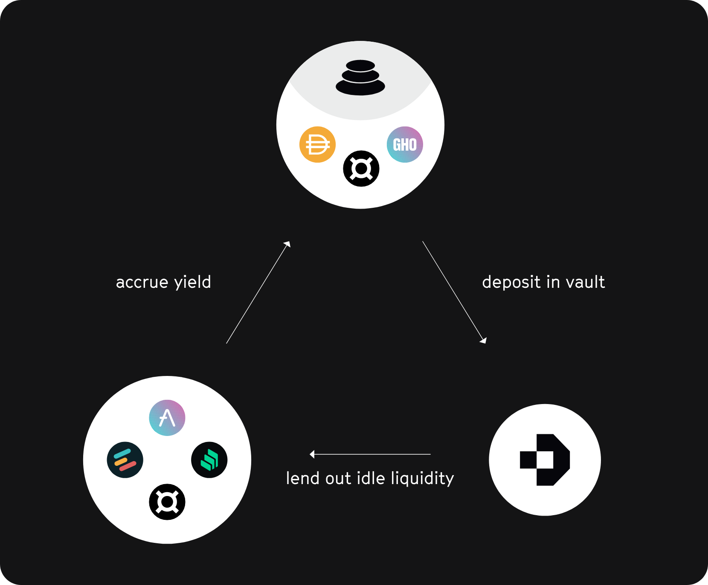
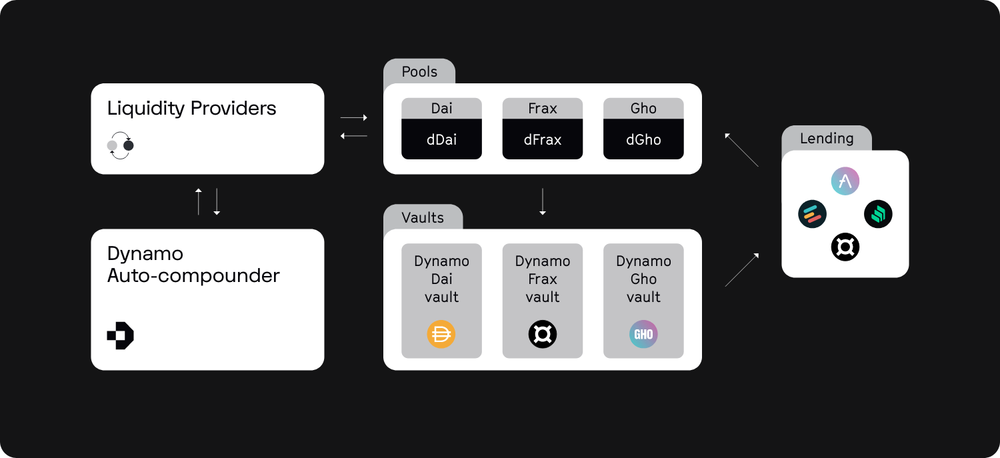

### Abstract

Decentralized finance has emerged over the years as the prevailing use-case of
smart contract technology by offering a more efficient and transparent environment
for the development of financial applications.
As Defi grew over time, developers took advantage of the composability offered to
them by smart contracts, turning the decentralized stablecoin space into fertile
ground for financial innovation.
However, decentralized stablecoins need to attract liquidity at scale in order to
become viable and in order for them to achieve this the DeFi space needs to develop
the right mechanisms for attracting and maintaining liquidity.
The presented protocol aims to develop a yield-optimized liquidity foundation by
developing a 3pool comprised of the three decentralized stablecoins that builds on
top of Balancer's boosted pool designs in order to offer optimized yields to liquidity
providers from the integration of swap activity and optimized lending market capital
allocation that can be offered by the use of our ERC-4626 vaults.
Each component of our base liquidity pool is connected to its respective vault generating
optimized lending market yield in the backend.
This symbiosis maximizes yield and paves the way for the creation of a liquidity layer for
decentralized stablecoins.

### Introduction

Asset lending constitutes a relatively low risk activity for decentralised finance (DeFi)
users that are interested in putting their portfolio assets to productive use with a multitude
of lending venues being available to facilitate decentralised lending activities.
Platforms such as Aave, Compound, and Fraxlend allow their users to generate yield on their
capital while keeping custody of their assets.
Decentralised lending has facilitated a large part of DeFi's growth with the lending pool model
becoming the dominant implementation in the space leading to the dominance of utilisation based
interest rate models. Thus, in the presence of a surplus of available capital, interest rates on
lending protocols decrease.
The existence of multiple DeFi protocols leads to interest rate imbalances that come as a
result of different utilisation rates in different lending markets.

Dynamo Finance aims to optimise lending yields by developing a decentralised solution that
utilises the underlying capital in a multitude of lending venues in order to extract the
highest possible interest rate out of each supported asset.
Our ERC-4626 vaults react in real time to interest rate fluctuations across DeFi venues by
rebalancing their allocations in a manner that maximises yield between different whitelisted
lending platforms.
Our vaults allows anyone to participate in their rebalancing process and encourage the
decentralisation of the weight rebalancing process by incentivising the process with part
of the yield that the respective vaults generate from a rebalancing proposal.
Our infrastructure is designed in a manner that aims to maximise utilisation by the broader
DeFi space allowing anyone to build on top of it.

Dynamo vaults can facilitate a wide array of use cases with the optimisation of liquidity
provision in stable swap pools being just one example of its capabilities.
The upcoming integration of our vaults with the Balancer V2 boosted pool framework will act
as a proof of concept by allowing liquidity providers to take advantage of our boosted pools
in order to optimise their liquidity.
This can accelerate the development of liquidity for decentralised stablecoins and other
assets by allowing liquidity providers to generate an optimised lending yield out of their
idle liquidity.
We show explicitly in an example study how idle liquid can be unlocked to increase annual
percentage yields (APY) for liquidity providers.
This strategy will enable us to offer highly competitive APYs that even outperform current
state-of-the-art liquidity pools like Curve Finance's 3pool.

### Swap invariants for liquidity pools

The concept of an automated market maker (AMM) was first discussed by Vitalik Buterin,
later generalized by Alan Lu, and finally proven viable for market making by the
well-established Uniswap automated market maker.
AMMs are based on invariants that describe how assets should be priced upon swap events
within liquidity pools.

Uniswap's constant product invariant describes liquidity as uniformly distributed along the

$$
q_P\times q_L = K
$$

reserve curve, where $q_P$ and $q_L$ are the respective reserves of two assets $P$ and $L$,
and $K$ is the invariant.
Let us take this reserve curve as a basis for an example to show how a swapping event
would look like.
Imagine we have a liquidity pool that is composed of two assets each holding 100 coins (A and B).
The invariant is calculated as follows

$$
q_P\times q_L = (100)\times (100) = 10,000.
$$

The reserve curve determines how much B a user gets for a certain amount of A

$$
(q_{B} - p) \times (q_{A} + l) = q_P\times q_L,
$$

and for an example amount of 50 A

$$
    p = q_{B} - \frac{q_P\times q_L}{q_{A} + l} = 100 - \frac{10,000}{100 + 50} \approx 33.\overline{3},
$$

we calculate that the user obtains 33.$\overline{3}$ B in exchange.
Balancer introduced a multi-dimensional reserve curve that defines a cost function for the
exchange of any pair of tokens held in a Balancer Pool (BP).
The price reserve is defined as

$$
K = \prod\limits_t\,B_t^{W_t},
$$

where $t$ ranges over the tokens in the BP, $B_t$ is the balance of the tokens in the BP,
and $W_t$ is the normalized weight of the tokens such that the sum of all weights equals unity.
Each pair of tokens (in = $i$ and out = $o$) has a spot price (SP) defined entirely by their
weights ($W_i$ and $W_o$) and balances ($B_i$ and $B_o$)

$$
SP_i^o = \frac{B_i/W_i}{B_o/W_o}.
$$

Swap fees (x) are taken into account by adjusting the given definition slightly

$$
SP_i^o(x) = \frac{SP_i^o}{1 - x}.
$$

Furthermore, a stablecoin reserve curve has been implemented to allow for swaps between assets
that are pegged with each other.
Most common examples are US Dollar tracked stablecoins (_e.g._, DAI, Tether, and USDC),
and assets that track the price of Bitcoin (_e.g._, wBTC, renBTC, and sBTC).
Spot prices are determined by the BP balances, the amplification parameter $A$, and the
amount of tokens that are being swapped.
Ideally, it would make sense to simply allow for 1-to-1 swaps between assets, which
would be a constant sum reserve curve.
However, once an asset loses its peg and its value diverges, it would make sense to
enforce trade rules for uncorrelated assets, which would be a constant product reserve curve
as discussed above.
Balancer therefore uses the amplification parameter to define to which degree the reserve curve
approximates the constant product curve ($A = 0$), or the constant sum curve
($A \rightarrow \infty$).

$$
A\,n^n\,\sum\limits_i\,B_i + K = A\,K\,n^n + \frac{K^{n+1}}{n^n\, \prod\limits_i\,B_i},
$$

where $n$ is the number of tokens, $B_i$ is the balance of token $i$,
and $A$ is the amplification parameter.
In order to solve the equation from above, either for $B_i$ or $K$, we need to define
it in a form like $F(\textbf{B},K)=0$.
Then the invariant ($K$) is solved iteratively using the Newton-Raphson method.
The idea is to start with an initial guess, approximate the function by its tangent line,
and finally compute the intercept of this tangent line.
This intercept will typically be a better approximation to the original function's root
than the first guess, and the method is iterated until convergence is reached.
If the tangent line to the curve $F(\textbf{B}, K)$ at $K=K_n$ intercepts at $K_{n+1}$
then the slope is

$$
F'(\textbf{B}, K_n) = \frac{F(\textbf{B}, K_n) - 0}{K_n - K_{n+1}} \quad \rightarrow \quad K_{n+1} = K_n - \frac{F(\textbf{B}, K_n)}{F_K'(\textbf{B}, K_n)}.
$$

The algorithm for swaps first solves $F(\textbf{B}, K)=0$ equation against $K$,
then against $B_j$ given $B_i$ which is increased by the amount of coin $i$ that is traded in.

$$
B_{i, k+1} = B_{i,k} - \frac{F(B_{i,k},\dots,K)}{F_{B_i}'(B_{i,k},\dots,K)}
$$

### Balancer boosted pool architecture

Balancer boosted (BB) pools offer the best of both worlds for liquidity providers and swappers.
Swappers get access to deep stablecoin liquidity with near-parity exchange rates, while liquidity
providers can send their liquidity positions to external lending market protocols like Aave.
These versions of stable pools do not directly hold the stablecoins themselves, but rather hold
the pool tokens of nested linear pools, which, for the Aave example, maintain proper balances of
_TOKEN_ and _aTOKEN_ facilitating trades between them.
Boosted pools are designed to deliver high capital efficiency by enabling users to provide trade
liquidity for common tokens while forwarding idle tokens to external protocols.
This gives liquidity providers the benefits of a yield generator on top of the swap fees they
collect from trades within the base pool.
Furthermore, nesting pool tokens creates a powerful avenue for swaps between any stablecoin
and any wrapped token in the boosted pool.

One of the key features that makes trades through boosted pools so simple is the use of
phantom pool tokens (PPT).
Normally when a liquidity provider joins/exits a pool, the pool mints/burns pool tokens as needed.
This is gas intensive and requires users to execute a _join_ or _exit_.
In pools that use PPT, however, all pool tokens are minted at the time of pool creation and are
held by the pool itself.
Liquidity providers use a _swap_ (or more likely Balancer's _batchSwap_) to trade to or from
a pool token to _join_ or _exit_, respectively.

The BB Aave USD Pool (bb-a-USD) demonstrates how nesting linear pools with PPT inside a stable
pool with PPT can consolidate stablecoin liquidity while improving the liquidity provider experience.
First, three linear pools are created for _DAI_, _USDC_, and _USDT_ each having PPT
(bb-a-$\star$, $\star$ = _DAI_, _USDC_, and _USDT_) and maintain target balances for base tokens
and their wrapped counterparts.
By integrating multiple linear pools into a boosted pool, we are effectively putting the pools
inside another pool (termed as base pool).
Swapping tokens within the base pool is possible through the use of _batchSwap_ calls
that go from one stablecoin to another as exemplified in the figure below.

#### Linear pools

Linear Pools are the base component of BB pools.
They use linear math to facilitate trades between two tokens at a known exchange rate.
They also use a positive or negative fee mechanism to incentivize arbitrageurs to maintain
a desired ratio between the two tokens.
For example, the bb-a-DAI balances _DAI_ with _aDAI_, facilitating _DAI_ trades while
maintaining a large _aDAI_ balance for an extra boost to liquidity providers.

### Dynamo Finance vaults

DeFi users want to productively invest their assets in various lending platforms such
as Aave, Compound, and Fulcrum.
All those platforms support lending markets for the largest stablecoins and various
other highly liquid assets.
Unfortunately, the nature of lending protocols makes the returns on lent assets
inversely proportional to the availability of capital in the respective lending pools.
Thus, in the presence of a surplus of available capital interest rates on lending
protocols decrease.
The existence of multiple DeFi protocols leads to interest rate imbalances that come
as a result of different utilisation rates in different lending markets
(see figure below for one example showing annual percentage yield (APY)
fluctuations for _DAI_ on Compound (_CDAI_) and Aave (_ADAI_)).

Yearn Finance was the first DeFi protocol to take advantage of
such discrepancies by providing automatic capital migration to the protocol with the
highest returns at the time.

In this paper, we describe the design of Dynamo Finance vaults, which tackle the problem
of low organic stable swap yields by developing a modular liquidity management stack comprised
of a yield aggregator and a liquidity network bootstrapped on top of Balancer V2.
By integrating these two components, we develop an optimized stable swap offering that can
provide sustainable yields at scale to attract and retain large amounts of stablecoin liquidity.

Our yield strategy aggregates lending markets such as Aave, Compound, and Euler to extract
the highest possible yield out of each supported asset by reacting in real-time to interest
rate fluctuations.
We achieve this by rebalancing our exposure between our whitelisted lending markets to capture
the added value that can be generated through active capital management.
Below we exemplify this setup for a boosted 3pool consisting of _DAI_/_GHO_/_FRAX_.

In the case of assets with protocol derived yield sources such as _LUSD_,
Dynamo vaults can optimize returns by tapping into the associated yield flows
and auto-compound the additional rewards they generate on behalf of our users.

Our ERC-4626 vault represents the liquidity allocations by weights contributing
liquidity into the underlying whitelisted lending markets in a manner that ensures
an optimised return on the allocated capital.
It is important that the weights within the vault can be adjusted in a permissionless manner.
The advantage of this design is that there is no need for the existence of whitelisted accounts
that are constantly aware of the current returns by opening the vault rebalancing process to every
user of the protocol.

Additional lending protocols can easily be added to a vault in the future by deploying a suitable
protocol adapter _via_ our protocol factory.
Each vault is therefore a pool of capital that represents a particular asset that is deposited
into the vault by its users.
The asset is allocated dynamically across the whitelisted lending markets for the generation of
yield.

### Dynamo base pools

We use a boosted pool that includes three linear pools to create a boosted stable liquidity pool.
The linear pools shift 90% of the linear pool liquidity into an asset specific ERC-4626 vaults,
which distribute the liquidity within the registered lending markets according to the active
strategy.
The remaining liquidity (10%) is earmarked for swaps within the pool.
A liquidity provider can thus provide one of the assets in the pool and receive the Dynamo
USD (_dUSD_) liquidity pool token as a receipt.
Below we exemplify this setup for a boosted 3pool consisting of _DAI_/_GHO_/_FRAX_,
where the _DAI_ vault is shown in detail for clarity.

### Market analysis

In this section, we take one of the best-known liquidity pools as an example and show how base
rewards can be improved. As an example we use Curve Finance's 3pool which consists of
_DAI_, _USDC_, and _USDT_ (data has been taken from DefiLlama).
The figure below shows the rewards as extracted for Curve’s 3pool.
Base rewards are those generated by swaps and liquidity rewards are additional incentives
generated by CRV.

We extracted annual percentage yields (APY) for all assets that are available in Curve's 3pool.
Each asset shows a higher average APY if comparing directly to Curve's 3pool averaged APY.
This motivates the creation of a liquidity pool that takes some amount of the liquidity to
deploy it to those higher APY sources.

We have taken the data from the respective lending markets to create a setup that resembles a
Dynamo base pool with the assets available in the 3pool (_DAI_/_USDC_/_USDT_ each 1/3).
We use 90/10 liquidity allocations in the respective linear pools (90% are deployed to
lending markets and 10% are available for swaps).
Note that other boosted pools have a different fee structure where 50% of the generated
yield goes to the Balancer DAO, however, Dynamo pays only 10% for this purpose.
Furthermore, fees that are incurred when using a Dynamo base pool are 11% Dynamo protocol
fee from which 1% is meant to pay strategists that propose yield increasing sets of weights.

Differences in average annual percentage yields (APY) between Curve Finance's 3pool
(_DAI_/_USDC_/_USDT_) and same assets as deployed within a potential Dynamo base pools
(protocol adapters: Aave, Compound, and Euler) are shown in the table below.
We added the minimum swap fees and liquidity mining rewards for Dynamo as extracted from
the bb-a-USD pool.

| Protocol | Base | Incentives | APY |
| -------- | ---- | ---------- | --- |
| Curve    | 0.4  | 0.4        | 0.8 |
| Dynamo   | 1.7  | 1.5        | 3.2 |

The table above lists the average annual percentage yields (APY) for Curve Finance's 3pool
within 137 days (data covers the range of 2022-09-21 to 2023-02-04, data from DefiLlama)
and for the Dynamo base pool for the same time range.

As can be seen, the Dynamo APY value for the base pool is much higher compared to Curve's 3pool.
Hence we are able to outperform a well-established liquidity pool by shifting idle pool liquidity
to lending markets to activate the full APY potential already without including liquidity incentives.
Once we include liquidity mining rewards (approx. 1.5-3.6%, values taken from the bb-a-USD pool),
we are able to obtain one of the highest APY value within the current DeFi market for a liquidity
pool.
Note that we approximate liquidity incentives by taking the lowest bb-a-USD value (1.5%) to
calculate the final Dynamo APY of our base pool.
To conclude this section, we can consistently outperform Curve Finance's 3pool APYs as well as
other Balancer boosted pools.
The _DAI_/_USDC_/_USDT_ example above shows an increased APY (four times) compared to Curve's 3pool.
Please note that we used data from the past to create these APYs.
This prediction is meant to showcase the idea of our boosted pool infrastructure and is no financial advice!
